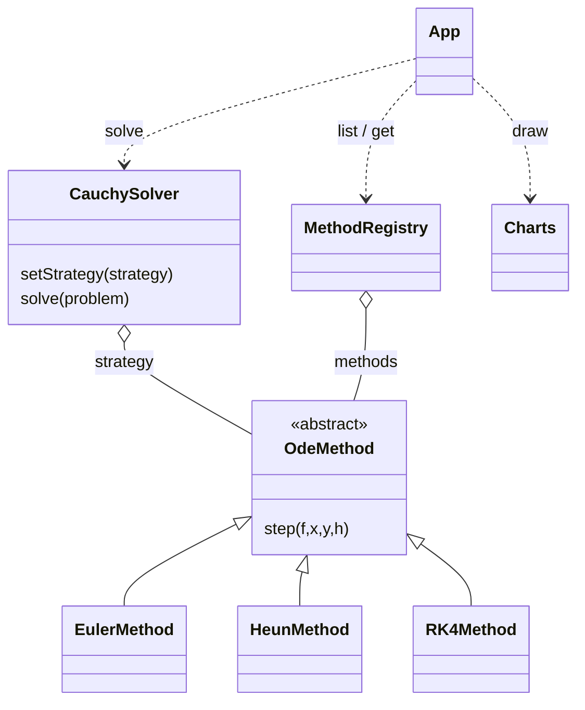
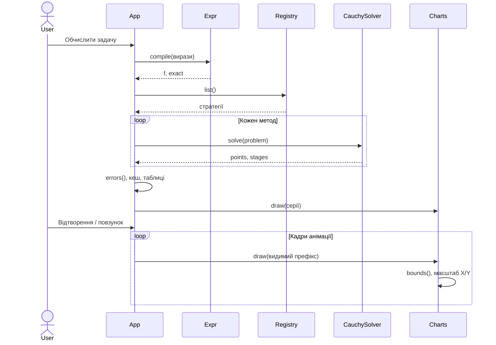

# UML: Strategy і взаємодія

```mermaid
classDiagram
 class OdeMethod {
   <<abstract>>
   step(f,x,y,h)
 }
 OdeMethod <|-- EulerMethod
 OdeMethod <|-- HeunMethod
 OdeMethod <|-- RK4Method
 CauchySolver o-- OdeMethod : strategy
 MethodRegistry o-- OdeMethod : methods
 App ..> MethodRegistry : list / get
 App ..> CauchySolver : solve
 App ..> Charts : draw
 class CauchySolver {
   setStrategy(strategy)
   solve(problem)
 }
```

```mermaid
sequenceDiagram
 actor User
 participant App
 participant Expr
 participant Registry
 participant Solver as CauchySolver
 participant Charts
 User->>App: Обчислити задачу
 App->>Expr: compile(вирази)
 Expr-->>App: f, exact
 App->>Registry: list()
 Registry-->>App: стратегії
 loop Кожен метод
   App->>Solver: solve(problem)
   Solver-->>App: points, stages
 end
 App->>App: errors(), кеш, таблиці
 App->>Charts: draw(серії)
 User->>App: Відтворення / повзунок
 loop Кадри анімації
   App->>Charts: draw(видимий префікс)
   Charts->>Charts: bounds(), масштаб X/Y
 end
```
